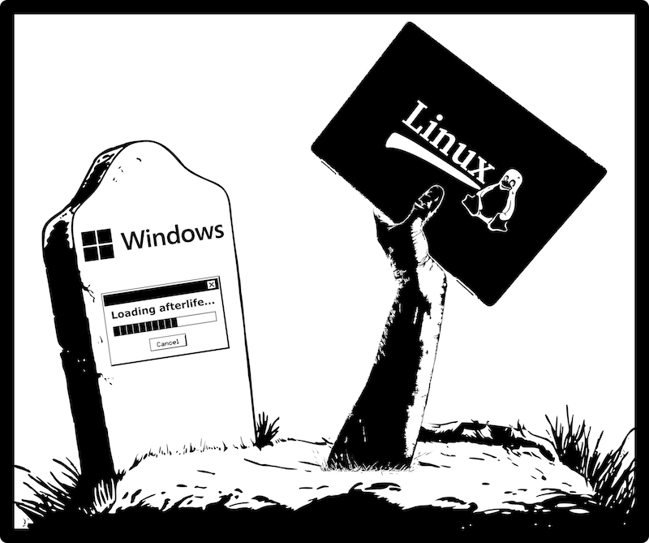

# Resurrect Your Laptop with Linux

- Pre-workshop activities: 10 min 
- Introductory presentation: 10 min
- Hands-on activities: 60-90+ min, depending on your system, and ease of installation

## Why Linux? 

Linux operating systems are free and more functional than ever before. Many gamers are switching to Linux because games are running better and faster than on Windows 11. Others are switching to Linux because they want an AI-free computer. 

Installing Linux is also an alternative to having to throw away your old(er) computer. Most popular Linux operating systems, like Linux Mint and MX Linux, require far less performance power than modern Windows or Mac operating systems. What this means in practical terms is that a computer bogged down when running Windows 11 might have more than enough performance for Linux to run well.

Linux is growing all the time. Currently, and depending of what type of Linux operating system you install, you have access to tens of thousands of software packages, and all for free. Linux also has a number of commonly used, open-source apps to replace the ones you might find on Windows or Mac systems. For example, LibreOffice is an open source office suite intended to compete with Microsoft Office.

Linux is not perfect—no operating system is. But, for everyday computer tasks like writing documents, browsing the internet, listening to music, editing images, and more, it is a truly viable alternative to Windows and Mac operating systems. Becasue Linux allows for so much more control over your computer than you get with Windows or Mac cpmputers, it is one way to reclaim some control over your digital life. 

## Laptop resurrection objectives 🪦

This workshop is informal by design, but we still have some hopes that you will learn about the following: 

- some aspirations of the "permacomputing" community of practice
- what Linux is as an operating system
- how to install Linux on a laptop computer
- the basics of how to use your Linux operating system
- where to go for more Linux resources and support

 
[NEXT STEP: Pre-Workshop Activities](pre-workshop.html){: .btn .btn-blue }
